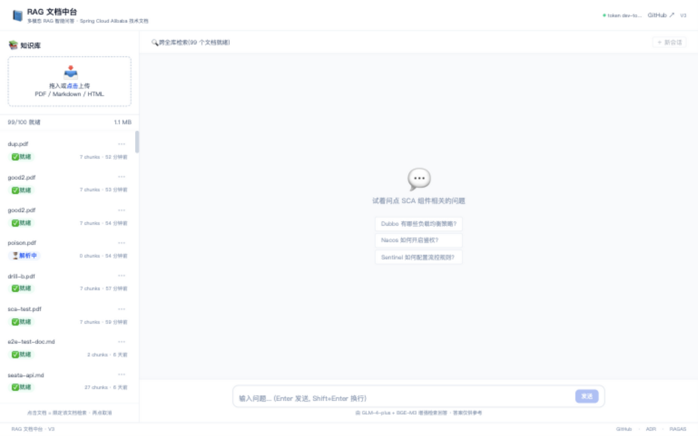
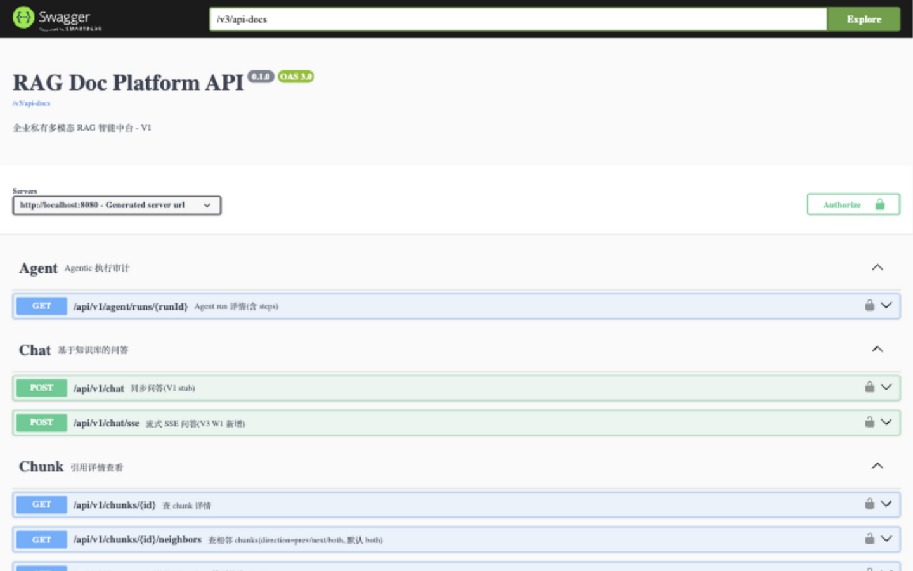
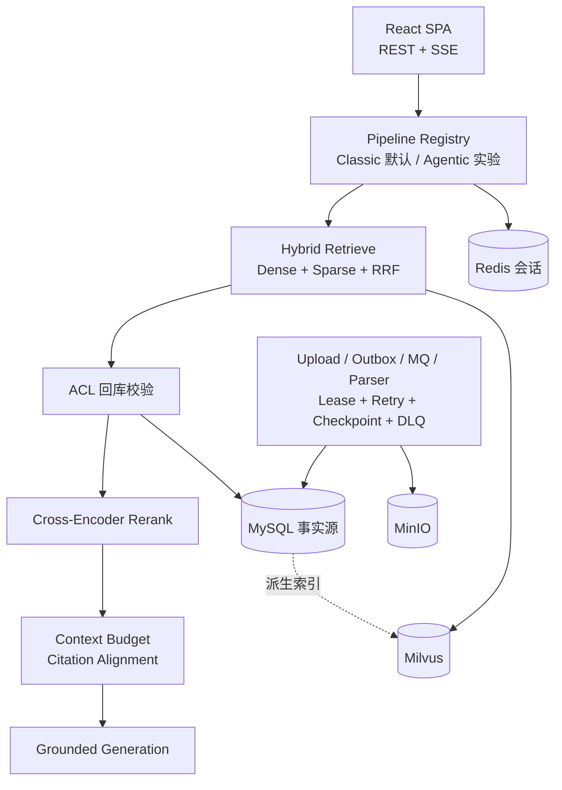
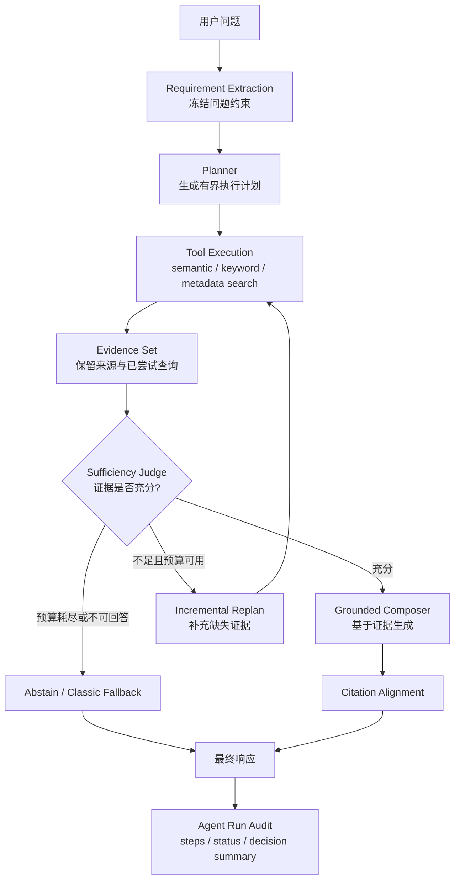

<div align="center">

# 🥝 KiwiRAG

### Reliable RAG infrastructure for knowledge-intensive applications

可靠接入 · 混合检索 · 上下文工程 · 可追溯引用 · 评测门禁

[快速开始](#快速开始) · [系统架构](#系统架构) · [评测结果](#经过验证的结果) · [深入文档](#深入文档)


[](https://github.com/HHHAnQi/KiwiRAG/actions/workflows/ci.yml)
[](https://github.com/HHHAnQi/KiwiRAG/actions/workflows/frontend-ci.yml)

</div>

> **设计原则：更复杂的 AI Pipeline 只有在端到端评测中带来可验证收益，才进入默认执行路径。**

KiwiRAG 是一个面向生产环境的私有知识库问答平台。它覆盖从文档可靠接入、混合检索、
上下文预算到可信引用生成和系统化评测的完整链路；所有关键能力均以真实故障、消融实验或
回归门禁验证，而不是仅停留在功能演示。

## 项目预览

| 知识库管理 | Agent 执行审计 |
| :---: | :---: |
|  |  |

## 为什么选择 KiwiRAG

| 常见 RAG Demo | KiwiRAG |
| --- | --- |
| Vector Top-K 单路召回 | Dense + Sparse + RRF + Cross-Encoder Rerank |
| 同步文档处理，进程中断后容易丢失进度 | Outbox + MQ + Lease + Retry + Checkpoint + DLQ |
| 检索结果直接拼接进 Prompt | Query Rewrite + Context Selection + Token Budget |
| 引用只是生成文本中的编号 | Citation Alignment + 可选 Citation Verification |
| 人工查看少量 Case 判断效果 | 四层评测 + 配对 A/B + CI 回归门禁 |
| 默认认为 Agent 越复杂越好 | Classic / Agentic 通过实验选择，当前默认 Classic |

## 核心能力

- **Hybrid Retrieval**：Dense + Sparse 召回、RRF 融合和 Cross-Encoder 精排；重排消融中
  faithfulness 提升 **9.2pp**、recall 提升 **7.5pp**。
- **Reliable Ingestion**：支持幂等上传、异步解析、租约、断点续传、重试和 DLQ；
  kill-9、毒消息及重复投递故障注入均通过验证。
- **Context Engineering**：支持多轮查询改写、异步历史压缩、双闸门上下文预算和截断后的引用同步对齐。
- **Grounded Generation**：引用锚定真实 chunk，每次回答携带 `traceId`，可追溯完整执行过程。
- **Evaluation Harness**：覆盖检索、生成、拒答和 Agentic 对照评测，指标退化超过阈值时阻断合入。

## 经过验证的结果

| 验证项 | 结果 | 证据 |
| --- | ---: | --- |
| Classic RAG faithfulness | **0.885** | [冻结结果与口径](docs/evaluation/CLAIM_EVIDENCE_MATRIX.md) |
| Classic RAG recall | **0.90** | [冻结结果与口径](docs/evaluation/CLAIM_EVIDENCE_MATRIX.md) |
| Rerank 消融 | faithfulness **+9.2pp** | [Claim → Evidence](docs/evaluation/CLAIM_EVIDENCE_MATRIX.md) |
| 语义充分性判定人工一致率 | 42% → **96%** | [Agentic 分析](docs/agentic/WHEN_TO_USE_AGENTIC_RAG.md) |
| 可靠接入故障注入 | **3/3 PASS** | [故障注入报告](docs/reliability/FAULT_INJECTION_REPORT.md) |

Agentic 路径从修复前相对 Classic 的 **-8.3pp** 收敛到 **-0.2pp（统计平手）**，
但延迟约为 **2.8×**。因此它作为实验能力保留，默认执行路径仍是 Classic RAG。
这是评测驱动工程在本项目中的关键结论，而不是未完成状态。

## 系统架构



MySQL 是事实源，Milvus 是可重建的派生索引。召回后会回库校验租户、软删除状态和 generation，
以避免索引与权限漂移。更完整的读写路径和模块关系见
[架构文档](docs/architecture/architecture-diagrams.md)。

### Agentic RAG 执行循环

Agentic RAG 是 KiwiRAG 中已实现的实验执行策略。它共享相同的检索、权限和引用基础设施，
但在检索之上增加了有界规划、工具执行、证据充分性判断和增量重规划：



该循环受步骤数、工具调用、LLM 调用、Token、成本和总时长预算约束，避免无界规划。
当前评测中，修复后的 Agentic 路径与 Classic 质量基本持平，但延迟约为 **2.8×**，
因此默认保持关闭（`RAG_AGENT_PLANNER_ENABLED=false`）。何时值得启用 Agentic 路径，
见 [何时使用 Agentic RAG](docs/agentic/WHEN_TO_USE_AGENTIC_RAG.md)。

## 快速开始

### 运行模式

| 模式 | 适用场景 | GPU |
| --- | --- | --- |
| Minimal | 本地开发和功能体验；保留 Hybrid Retrieval，关闭 reranker | 不需要 |
| Full | 完整精排、异步接入、评测与可观测性 | reranker 建议使用 |

### 前置条件

- JDK 17
- Docker 24+，并支持 Docker Compose v2
- Node.js 22+（仅运行前端时需要）
- 一个 OpenAI-compatible LLM API Key

### 1. 克隆并配置

```bash
git clone https://github.com/HHHAnQi/KiwiRAG.git
cd KiwiRAG
make env
```

编辑 `.env`，至少替换 `LLM_API_KEY`。该文件已被 Git 忽略，请勿提交真实密钥。

Minimal 模式请在 `.env` 中设置：

```dotenv
RAG_RERANK_ENABLED=false
```

### 2. 启动依赖与后端

```bash
make up
make ps
make run
```

后端默认运行在 `http://localhost:8080`，Swagger UI 位于
`http://localhost:8080/swagger-ui.html`。

### 3. 启动前端

```bash
cd frontend
npm install
npm run dev
```

浏览器打开 `http://localhost:5173`。前端开发服务器会将 `/api/*` 代理到后端。

### 4. 验证与停止

```bash
make test
make down
```

首次启动需要下载容器镜像，所需时间取决于网络环境。Full 模式的 GPU reranker 部署见
[Autodl Reranker SOP](docs/operations/autodl-reranker-sop.md)。

## 项目结构

```text
KiwiRAG/
├── platform-common/       # Domain、Port、共享模型与核心能力
├── platform-bootstrap/    # Spring Boot 应用和在线 RAG Pipeline
├── parser-service/        # MQ 驱动的可靠文档解析与索引
├── frontend/              # React 19 + Vite 前端
├── eval/                  # 数据集、评测脚本、基线和回归门禁
├── perf/                  # 性能测试与报告
├── deploy/                # Docker Compose 与部署配置
├── docs/                  # 架构、ADR、评测、可靠性和运维文档
└── .github/workflows/     # 后端、前端和评测 CI
```

## 深入文档

| 主题 | 入口 |
| --- | --- |
| 架构与核心数据流 | [Architecture Diagrams](docs/architecture/architecture-diagrams.md) |
| 评测方法、冻结结果与证据 | [Evaluation](docs/evaluation/) · [Claim → Evidence](docs/evaluation/CLAIM_EVIDENCE_MATRIX.md) |
| 可靠接入与故障注入 | [Fault Injection Report](docs/reliability/FAULT_INJECTION_REPORT.md) |
| Agentic RAG 的适用边界 | [When to Use Agentic RAG](docs/agentic/WHEN_TO_USE_AGENTIC_RAG.md) |
| 性能测试口径 | [Performance Report](perf/performance_report.md) |
| 架构决策 | [ADR](docs/adr/) |
| 本地与评测运维 | [Operations](docs/operations/) |
| 前端开发 | [Frontend](frontend/README.md) |

## 当前限制

- 完整 reranker 路径依赖外部 GPU；公开性能结果主要来自单机开发环境。
- 当前题集以合成的 extractive ground truth 为主，尚缺真实用户流量校准。
- Agentic 路径质量没有显著超过 Classic 且延迟更高，因此默认关闭。
- LLM Judge 的人工校准样本仍有限，完整口径见评测文档。
- 前端在 SSE 服务端错误后偶发状态锁死；错误状态见
  [截图](docs/assets/chat-error-state.png)和[发布审计](docs/audits/FINAL_RELEASE_GATE.md)。

## 参与项目

欢迎提交问题和改进建议。开始贡献前请阅读 [CONTRIBUTING.md](CONTRIBUTING.md)；
安全问题请按照 [SECURITY.md](SECURITY.md) 中的方式报告。

## License

本仓库尚未选择开源许可证。在许可证确定之前，代码默认保留所有权利，不应视为已获得复制、
修改或再分发授权。
